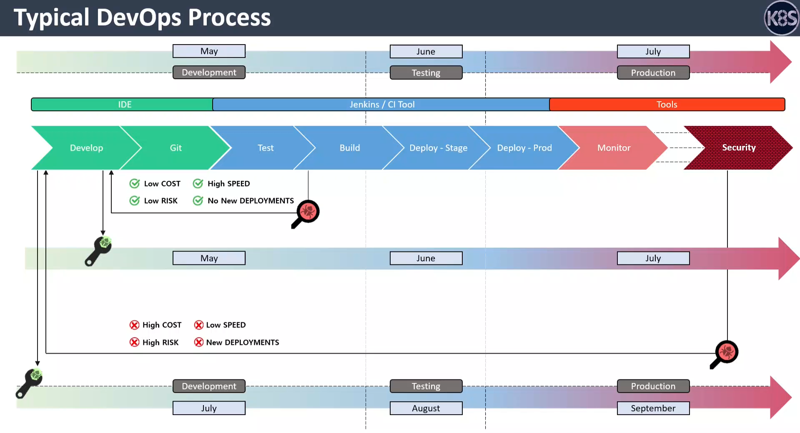
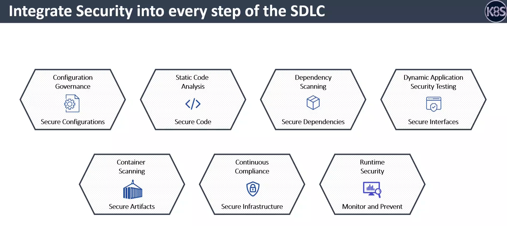
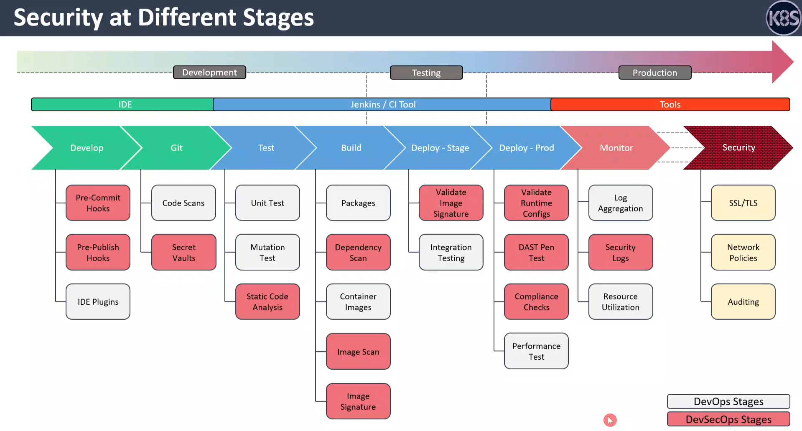
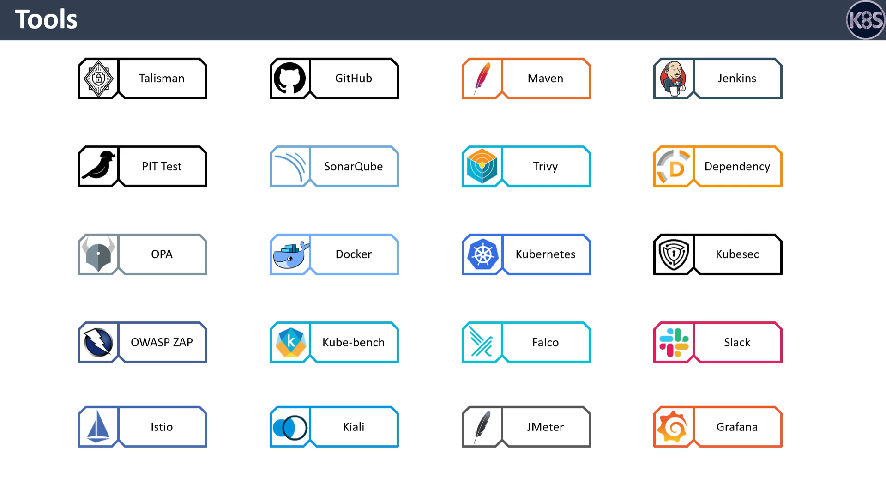

Source: DevSecOps - Kubernetes DevOps & Security with Hands-On Labs - Udemy
# DevSecOps 定义

**DevSecOps** 是 Development（开发）、Security（安全）和 Operations（运维）的结合，是一种将安全性融入到整个软件开发生命周期中的理念和实践方法。

## 核心概念

DevSecOps 强调将安全实践与开发和运维流程紧密整合，而不是在开发后期才考虑安全问题。

## 主要特点

| 方面 | 说明 |
|------|------|
| **左移策略** | 将安全检查从后期移到开发早期 |
| **自动化** | 自动化安全扫描、测试和合规检查 |
| **持续集成** | 在 CI/CD 管道中集成安全工具 |
| **团队协作** | 开发、安全和运维团队协同工作 |

## 关键实践

1. **代码审查和漏洞扫描** - 静态代码分析（SAST）
2. **动态测试** - 动态应用安全测试（DAST）
3. **依赖检查** - 检测第三方库的已知漏洞
4. **容器安全** - 镜像扫描和运行时保护
5. **基础设施安全** - 基础设施即代码（IaC）安全检查
6. **日志和监控** - 持续监控和安全事件检测
7. **自动化合规** - 自动验证安全策略

## 目标

- 在不牺牲安全性的前提下，加快应用交付速度
- 降低安全风险和后期修复成本
- 提高应用的整体安全性和可靠性

# 软件开发生命周期需要引入的安全活动
### 核心图表解析：SDLC 全流程安全嵌入矩阵

| 安全活动 (Security Activity) | 保护目标 (Protection Target) | 对应 SDLC 阶段 |
| :--- | :--- | :--- |
| **Configuration Governance** | Secure Configurations | 编码 / 基础设施即代码 |
| **Static Code Analysis** | Secure Code | 编码 / 提交 |
| **Dependency Scanning** | Secure Dependencies | 构建 |
| **Dynamic Application Security Testing** | Secure Interfaces | 测试 / 预发 |
| **Container Scanning** | Secure Artifacts | 打包 / 镜像仓库 |
| **Continuous Compliance** | Secure Infrastructure | 部署 / 云平台 |
| **Runtime Security** | Monitor and Prevent | 生产运行 |


### 详细解释

#### 1. Configuration Governance → Secure Configurations
- **技术释义**：在编写 Terraform、CloudFormation 或 Kubernetes YAML 文件时，通过策略即代码（Policy as Code）防止云资源配置错误（例如：禁止创建对公网开放的 S3 存储桶、禁止安全组开放 22 端口）。
- **生活类比**：**装修前的图纸审核**。不是在房子盖好后才发现厕所门对着厨房门（不安全且尴尬），而是在看图纸阶段就改掉设计缺陷。

#### 2. Static Code Analysis (SAST) → Secure Code
- **技术释义**：在白盒视角下扫描源代码中的硬编码密钥、SQL 注入拼接、不安全的随机数算法。
- **生活类比**：**写作文时的拼写与语法检查**。刚写完一句话，Word 就给你画了红线，立刻修正；比作文交上去被老师红笔批注重写要高效得多。

#### 3. Dependency Scanning (SCA) → Secure Dependencies
- **技术释义**：分析 `package.json` 或 `pom.xml` 中引用的第三方开源库是否存在已知 CVE 漏洞（如 Log4Shell）。
- **生活类比**：**盖楼用的钢筋水泥合格证检查**。你自己砌墙手艺再精湛，如果运来的水泥是过期失效的，楼依然会变成危房。

#### 4. Dynamic Application Security Testing (DAST) → Secure Interfaces
- **技术释义**：在应用运行时模拟黑客攻击，扫描 API 接口是否存在未授权访问、信息泄露或越权漏洞。
- **生活类比**：**房子装好锁具后，请专业师傅来试开锁**。看看窗户能不能从外面撬开，后门的猫眼是否会被工具伸进来开门。

#### 5. Container Scanning → Secure Artifacts
- **技术释义**：对 Docker 镜像进行分层扫描，排查操作系统层的高危漏洞以及是否存在被植入的挖矿木马。
- **生活类比**：**食品出厂前的 X 光异物检测**。罐头密封前，必须照一下确认里面没有掉进去的螺丝钉、头发丝或碎玻璃。

#### 6. Continuous Compliance → Secure Infrastructure
- **技术释义**：持续审计云账号是否符合 CIS 基准要求，例如：是否强制开启了 MFA 多因素认证、云审计日志是否已启用。
- **生活类比**：**物业的定期消防检查清单**。灭火器压力表指针还在绿区吗？消防通道门口有没有被违规停放的电瓶车堵住？

#### 7. Runtime Security → Monitor and Prevent
- **技术释义**：利用 eBPF 等技术监控容器运行时的异常行为（例如：一个原本只提供 Web 服务的容器突然开始执行 `curl` 下载文件）。
- **生活类比**：**家里的红外防盗报警器**。哪怕小偷技术高超打开了防盗门（前面防线被突破），只要他一走进客厅触发红外感应，警报就会立刻拉响并通知保安。


# 云厂商SDLC相关安全产品
## Huawei Cloud SDLC 安全活动覆盖映射
根据华为云HSS产品文档，**HSS（含容器安全版本）** 在SDLC各阶段的覆盖能力如下：
| SDLC 安全活动 | HSS 覆盖能力 | 覆盖程度 |
|:---|:---|:---|
| **Configuration Governance** | 基线检查 | ⚠️ 部分支持 |
| **Static Code Analysis** | 无 | ❌ 不支持 |
| **Dependency Scanning** | 容器镜像安全/应用漏洞检测 | ✅ 支持 |
| **Dynamic Application Security Testing** | 入侵检测/病毒查杀 | ✅ 部分支持 |
| **Container Scanning** | 容器镜像安全 | ✅ **全面支持** |
| **Continuous Compliance** | 基线检查（等保基线） | ✅ **支持** |
| **Runtime Security** | 入侵检测/病毒查杀/勒索防治/容器防火墙 | ✅ **全面支持** |

## 详细说明

**✅ 强覆盖**
- **容器镜像扫描**：支持容器镜像漏洞检测、恶意文件识别、基线检查
- **运行时防护**：400+威胁检测模型，支持勒索、挖矿、渗透、逃逸等检测
- **持续合规**：基于CIS基准、等保合规基线的自动化检查

**⚠️ 部分覆盖**
- **Configuration Governance**：主要支持主机/容器层配置检查，不支持代码层IaC合规检查
- **DAST**：通过入侵检测检测运行时异常，但非传统API安全测试

**❌ 不支持**
- **Static Code Analysis**：HSS是终端/运行时安全工具，**不支持源代码扫描**，需配合SAST工具（如SonarQube）

### 建议补充方案

要完整覆盖DevSecOps所有SDLC安全活动，HSS应配合：
- 代码扫描工具（SAST）
- 基础设施即代码扫描工具（Terraform/CloudFormation合规扫描）
- API 安全测试工具（DAST）


## AWS 在SDLC 安全活动中的覆盖能力

根据AWS最新文档，我来为你分析AWS在DevSecOps SDLC各阶段的产品覆盖能力。
| SDLC 安全活动 | AWS 产品方案 | 覆盖程度 |
|:---|:---|:---|
| **Configuration Governance** | AWS Config + CloudFormation Guard | ✅ 支持 |
| **Static Code Analysis** | Amazon CodeGuru + 第三方工具集成 | ⚠️ 部分支持 |
| **Dependency Scanning** | Amazon Inspector (代码库&ECR扫描) | ✅ 支持 |
| **Dynamic Application Security Testing** | AWS WAF + Amazon API Gateway + 第三方DAST | ⚠️ 部分支持 |
| **Container Scanning** | Amazon Inspector (ECR容器镜像) | ✅ **全面支持** |
| **Continuous Compliance** | AWS Security Hub + AWS Config | ✅ **支持** |
| **Runtime Security** | Amazon GuardDuty + EventBridge | ✅ **全面支持** |

## 详细对标分析

### ✅ 强覆盖能力

**1. 容器镜像扫描（Container Scanning）**
- Amazon Inspector 支持持续扫描 Amazon ECR 中的容器镜像
- 检测 OS 层和应用层漏洞、恶意软件
- 支持 SBOM（软件物料清单）导出

**2. 依赖扫描（Dependency Scanning）**
- Amazon Inspector 支持扫描代码仓库（GitHub、CodeCommit）中的依赖漏洞
- 覆盖 npm、pip、Maven、Gemfile 等包管理文件

**3. 运行时安全（Runtime Security）**
- Amazon GuardDuty 提供 EKS Protection、EC2 恶意软件防护、Lambda 运行时监控
- 检测勒索、挖矿、渗透、逃逸等威胁
- 与 Security Hub 联动自动响应

**4. 持续合规（Continuous Compliance）**
- AWS Config 支持基于规则的配置检查（CIS 基准、PCI DSS 等）
- AWS Security Hub 聚合合规信息和发现

### ⚠️ 部分覆盖能力

**1. 静态代码分析（SAST）**
- Amazon CodeGuru 提供基础代码质量和安全问题检测
- 不支持**代码层的深度 SAST 检测**（如 SQL 注入、XSS 的精准识别）
- 需要集成专业 SAST 工具（SonarQube、Checkmarx）

**2. 动态应用安全测试（DAST）**
- AWS WAF 提供应用层威胁防护但**非主动 DAST 工具**
- 需要集成专业 DAST 工具（OWASP ZAP、Burp Suite）
- 可通过 AWS CodeBuild 在 CI/CD 中运行 DAST 脚本

### ❌ 不支持

- **IaC 安全检查**：CloudFormation Guard 支持基础检查，但缺乏深度的 IaC 合规扫描

### AWS DevSecOps 高效方案设计

```
┌─────────────────────────────────────────────────────────────┐
│                   AWS DevSecOps 完整栈                       │
├─────────────────────────────────────────────────────────────┤
│ 编码阶段     │ CodeGuru (自动检测) + SonarQube/Checkmarx     │
│ 提交阶段     │ CodeBuild + Inspector (ECR扫描准备)         │
│ 构建阶段     │ CodeBuild + Inspector (依赖扫描)             │
│ 部署前       │ AWS Config (IaC检查) + CloudFormation Guard  │
│ 容器部署     │ Inspector (镜像扫描) + ECR                    │
│ 部署后       │ GuardDuty + Security Hub + AWS Config        │
│ 生产运行     │ GuardDuty + EventBridge (自动隔离响应)       │
└─────────────────────────────────────────────────────────────┘
```

## AWS vs 华为云 HSS 对比

| 维度 | AWS | 华为云 HSS |
|:---|:---|:---|
| **代码扫描** | ⚠️ 基础支持 | ❌ 不支持 |
| **容器镜像** | ✅ Inspector | ✅ 全面 |
| **运行时检测** | ✅ GuardDuty | ✅ 全面 |
| **IaC检查** | ⚠️ 部分 | ⚠️ 部分 |
| **合规检查** | ✅ Security Hub | ✅ 基线检查 |
| **集成度** | 原生集成 AWS 生态 | 华为云原生 |

## 建议补充方案

要达到企业级 DevSecOps，AWS 应配合：
1. **SonarQube/Checkmarx** - 深度代码扫描
2. **OWASP ZAP/Burp Suite** - 动态 API 测试（集成 CodeBuild）
3. **Terraform/CloudFormation 专用扫描工具** - IaC 合规检查（Checkov、CloudLocal）
4. **OPA/Kyverno** - Kubernetes 策略检查

这样才能实现**从代码到容器到生产的全链路安全左移**。


## HSS和Inspector关键区别对比
根据华为云HSS的官方文档和产品功能，**华为云HSS不支持像Amazon Inspector那样扫描源代码仓库中的依赖漏洞**。

| 功能维度 | 华为云 HSS | Amazon Inspector |
|:---|:---|:---|
| **源代码依赖扫描** | ❌ 不支持 | ✅ 支持 |
| 扫描对象 | 容器镜像、运行的容器/主机 | 代码仓库 + 容器镜像 + 计算实例 |
| 扫描时机 | 打包/部署/运行时 | 代码提交时 + 打包时 + 运行时 |
| package.json 等依赖文件 | ❌ 不扫描 | ✅ 直接扫描 |
| 检测 npm/pip 漏洞 | ❌ 不支持 | ✅ 支持 |

### 华为云HSS的依赖扫描能力

HSS 只能在**容器镜像层**检测依赖漏洞：
- 扫描已打包的容器镜像中的 OS 包漏洞（如 yum、apt）
- 扫描运行时应用层的漏洞

**不能做的**（Amazon Inspector 能做）：
- 扫描源代码仓库中的 `package.json`、`pom.xml` 等文件
- 在 CI/CD 早期阶段进行开发依赖检查
- 识别第三方库的已知 CVE

### 华为云的补充方案

如果要实现完整的 DevSecOps，华为云需要配合：

| 阶段 | 补充方案 |
|:---|:---|
| **编码/提交** | 集成 GitHub Dependabot / GitLab Dependency Scanning |
| **构建** | Snyk / Black Duck / Sonatype Nexus / WhiteSource |
| **部署** | HSS 容器镜像扫描 |
| **运行** | HSS 运行时防护 |

### 建议

华为云 HSS + 第三方 SCA 工具的最佳实践：
```yaml
CI/CD Pipeline:
  ├─ 代码提交 → Snyk/Dependabot 扫描依赖
  ├─ 构建阶段 → 生成容器镜像
  ├─ 镜像扫描 → HSS 容器镜像扫描
  └─ 部署/运行 → HSS 运行时防护
```

**结论**：AWS Inspector 在这方面覆盖更全面（包括源代码依赖扫描），华为云 HSS 主要聚焦容器和运行时安全。

# DevSecOps 工具链清单与价值

| 工具名称 | 核心用户 | 企业用途与价值 |
| :--- | :--- | :--- |
| **Talisman** | 开发人员 | 预提交钩子扫描，防止密钥、密码等敏感数据被意外提交到代码仓库。 |
| **GitHub** | 开发团队 | 代码托管与协作平台，通过分支保护与 Actions 实现 CI/CD 安全管控。 |
| **Maven** | Java 开发/构建工程师 | 项目构建与依赖管理，确保构建过程可重复且依赖来源可控。 |
| **Jenkins** | DevOps/构建工程师 | 自动化构建与部署引擎，串联安全扫描工具实现 DevSecOps 流水线。 |
| **PIT Test** | 开发/测试工程师 | 变异测试工具，衡量单元测试质量，发现测试用例覆盖盲区。 |
| **SonarQube** | 开发/代码评审人 | 持续代码质量与静态漏洞检查，统一团队编码规范与安全基线。 |
| **Trivy** | 安全/DevOps 工程师 | 轻量级容器镜像、文件系统及 Git 仓库漏洞扫描，快速集成 CI 流水线。 |
| **Dependency** | 开发/安全工程师 | 泛指依赖扫描工具（如 OWASP Dependency-Check），识别第三方库已知漏洞。 |
| **OPA** | 平台/安全工程师 | 统一策略引擎，以代码方式强制实施准入控制与配置合规（如 K8s 策略）。 |
| **Docker** | 开发/运维工程师 | 容器化打包应用及其依赖，保证环境一致性并作为制品安全扫描对象。 |
| **Kubernetes** | 平台/运维工程师 | 容器编排平台，内置 RBAC、网络策略与安全上下文等基础安全能力。 |
| **Kubesec** | DevOps/安全工程师 | Kubernetes 资源清单风险分析，评估 Pod 是否以过高权限运行。 |
| **OWASP ZAP** | 安全/测试工程师 | 动态应用安全测试（DAST），模拟攻击者探测接口漏洞与配置缺陷。 |
| **Kube-bench** | 安全/合规工程师 | 对照 CIS Kubernetes Benchmark 自动化检查集群配置是否符合安全基线。 |
| **Falco** | 安全/平台工程师 | 云原生运行时安全检测，监控异常进程行为与系统调用并实时告警。 |
| **Slack** | 全体项目成员 | 即时通讯与告警聚合中心，接收安全扫描结果及运行时异常通知。 |
| **Istio** | 平台/微服务架构师 | 服务网格，提供 mTLS 加密通信、细粒度访问控制与流量可观测性。 |
| **Kiali** | 运维/微服务开发 | Istio 可视化控制台，观察服务拓扑与流量状态，辅助排查安全策略问题。 |
| **JMeter** | 性能测试工程师 | 压力测试工具，验证高负载下应用稳定性及 WAF/限流策略是否生效。 |
| **Grafana** | 运维/SRE | 统一监控可视化仪表盘，聚合展示安全事件、系统性能与合规指标趋势。 |

