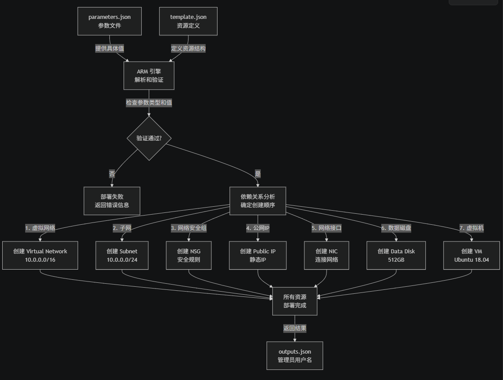
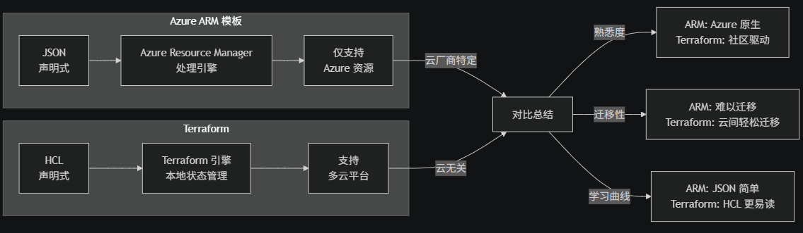

# Azure ARM 模板工作流程

**两个 JSON 文件的作用：**
- **template.json** - 描述"要创建什么"（资源定义、依赖关系、逻辑）
- **parameters.json** - 提供"具体参数"（名称、大小、配置值）

**工作流程图：** 



## ARM 模板 vs Terraform 对比 



## 详细对比表

| 维度 | Azure ARM | Terraform |
|------|-----------|-----------|
| **配置语言** | JSON | HCL（HashiCorp配置语言） |
| **支持的云** | 仅 Azure | AWS、Azure、GCP、阿里云等 |
| **状态管理** | Azure 云端管理 | 本地 `.tfstate` 文件或远程后端 |
| **学习成本** | 低（JSON 标准格式） | 中等（需学 HCL 语法） |
| **复杂性处理** | 函数和循环较难 | 变量、module 支持更强 |
| **社区生态** | Microsoft 官方支持 | 广大社区，资源丰富 |
| **多云部署** | ❌ 不能 | ✅ 能（一套代码多云） |
| **云迁移** | ❌ 难 | ✅ 易（更换 provider） |

## 本项目的实际工作流

**在本项目中：**

```
parameters.json 提供的值：
├─ location: "eastus" (东美部署)
├─ VM 名称: "devsecops-cloud"
├─ VM 大小: "Standard_D4s_v3" (4核16GB)
├─ 磁盘: 512GB
├─ 网络: 10.0.0.0/16 私网
├─ 安全规则: 允许所有+SSH入站
└─ 系统: Ubuntu 18.04-LTS

↓

template.json 定义的资源创建顺序：
1. 虚拟网络 (VNet) 
2. 子网
3. 网络安全组 (防火墙规则)
4. 公网 IP
5. 网络接口 (NIC)
6. 管理磁盘
7. 虚拟机 ← 最后创建，依赖前面的组件

↓

Azure Resource Manager 执行部署，生成可用的 DevSecOps 云开发环境
```

## 选择建议

- **用 ARM 模板**：只在 Azure，需要官方支持，团队熟悉 JSON
- **用 Terraform**：多云战略，需要迁移灵活性，代码可读性要求高

项目如果未来考虑混合云或多云，建议迁移到Terraform

# Kubernetes在企业中的常用知识点
完整的企业 K8s 生态


## 🔒 企业级 K8s 网络安全合规完整控制表

### **第0层：集群安全基准夯实**

| 模块 | 命令行示例 | 使用场景 | 关联模块 | 优先级 |
|------|----------|--------|--------|------|
| **kube-bench** | `wget https://github.com/aquasecurity/kube-bench/releases/download/v0.7.0/kube-bench_0.7.0_linux_amd64.tar.gz`<br>`tar xvzf kube-bench_0.7.0_linux_amd64.tar.gz`<br>`./kube-bench run --json > benchmark.json`<br>`./kube-bench run --targets node,controlplane,policies` | CIS Kubernetes 基准扫描、安全基线评估、合规报告 | API Server、kubelet、etcd | ⭐⭐⭐⭐⭐ 必须 |
| **kubelet 安全配置** | `cat /etc/kubernetes/kubelet-config.yaml \| grep -E "authentication|authorization|tlsCipherSuites"`<br>`systemctl show kubelet \| grep -E "\\-\\-tls-cert\\|\\-\\-tls-key"` | TLS 加密通信、客户端认证、授权模式 | API Server、RBAC | ⭐⭐⭐⭐ 推荐 |
| **etcd 加密** | `cat /etc/kubernetes/manifests/etcd.yaml \| grep -A5 "\-\-encryption-provider-config"`<br>启用加密：`--encryption-provider-config=/etc/kubernetes/encryption-config.yaml` | 静态数据加密、Secrets 保护、敏感信息 | API Server、Secrets | ⭐⭐⭐⭐⭐ 必须 |
| **TLS 证书验证** | `kubectl get csr`<br>`kubectl certificate approve csr-name`<br>`kubeadm certs check-expiration`<br>`kubeadm certs renew all` | 证书生命周期管理、自签名验证、过期告警 | RBAC、API Server | ⭐⭐⭐⭐ 推荐 |

---

### **第1层：CNI 网络数据平面**

| 模块 | 命令行示例 | 使用场景 | 关联模块 | 优先级 |
|------|----------|--------|--------|------|
| **Cilium eBPF CNI** | `helm repo add cilium https://helm.cilium.io`<br>`helm install cilium cilium/cilium --namespace kube-system --set image.tag=v1.12.0 --set ebpf.enabled=true`<br>`cilium status`<br>`kubectl get daemonset -n kube-system cilium` | 高性能网络、7层可见性、微分段、eBPF 可编程 | Hubble、NetworkPolicy、Egress Policy | ⭐⭐⭐⭐⭐ 推荐 |
| **Calico IP+网络** | `helm repo add projectcalico https://docs.projectcalico.org/charts`<br>`helm install calico projectcalico/tigera-operator --namespace tigera-operator --create-namespace`<br>`kubectl get tigerastatus` | IPv4/IPv6 支持、BGP 路由、IPv6 双栈、网络策略 | NetworkPolicy、IPAM | ⭐⭐⭐⭐ 推荐 |
| **CIS Pods 之间通信** | `kubectl get pods -A -o=custom-columns=NAME:.metadata.name,IP:.status.podIP,NODE:.spec.nodeName`<br>`kubectl exec -it pod-1 -- curl pod-2:8080` | Pod-to-Pod 连接、服务发现、DNS 解析 | ClusterIP Service | ⭐⭐⭐⭐ 推荐 |

---

### **第1B层：网络可观测性和性能？**

| 模块 | 命令行示例 | 使用场景 | 关联模块 | 优先级 |
|------|----------|--------|--------|------|
| **Hubble（Cilium 观测）** | `helm install hubble cilium/hubble-ui --namespace kube-system --values - <<EOF`<br>`relay:`<br>`  enabled: true`<br>`EOFPort-forward: kubectl port-forward -n kube-system svc/hubble-ui 8081:80`<br>`cilium hubble observe --pod default/`<br>`cilium hubble observe --verdict=DROPPED` | 网络流量可视化、网络策略调试、性能问题诊断 | Cilium、NetworkPolicy | ⭐⭐⭐⭐ 推荐 |
| **网络 QoS/Bandwidth 管理** | `kubectl set resources pod web --requests=cpu=100m,memory=128Mi --limits=cpu=500m,memory=256Mi`<br>Cilium Bandwidth：`kubectl annotate pod web cilium.io/egress-bw=1M`<br>`kubectl get endpoints -o wide` | 网络限速、避免拥塞、公平资源分配 | HPA、ResourceQuota | ⭐⭐⭐ 常用 |
| **IP 地址管理（IPAM）** | `kubectl get ipaddresspools -n kube-system`<br>Calico IPAM：`calicoctl ipam show`<br>`kubectl describe node node-1 \| grep -i "pods:"` | Pod IP 分配、子网规划、地址冲突检测 | CNI、NetworkPolicy | ⭐⭐⭐ 常用 |

---

### **第2层：网络安全策略和准入控制**

| 模块 | 命令行示例 | 使用场景 | 关联模块 | 优先级 |
|------|----------|--------|--------|------|
| **NetworkPolicy 入站策略** | `kubectl apply -f - <<EOF`<br>`apiVersion: networking.k8s.io/v1`<br>`kind: NetworkPolicy`<br>`metadata: {name: allow-frontend}`<br>`spec:`<br>`  podSelector: {matchLabels: {tier: backend}}`<br>`  policyTypes: [Ingress]`<br>`  ingress:`<br>`  - from:`<br>`    - podSelector: {matchLabels: {tier: frontend}}`<br>`      port: {protocol: TCP, port: 8080}`<br>`EOF` | 微分段隔离、3 层防火墙、东西向流量控制 | Namespace、Pod Labels | ⭐⭐⭐⭐ 推荐 |
| **NetworkPolicy 出站策略** | `kubectl apply -f - <<EOF`<br>`apiVersion: networking.k8s.io/v1`<br>`kind: NetworkPolicy`<br>`metadata: {name: deny-external}`<br>`spec:`<br>`  podSelector: {matchLabels: {app: web}}`<br>`  policyTypes: [Egress]`<br>`  egress:`<br>`  - to: [{podSelector: {matchLabels: {app: db}}}]`<br>`    port: [{protocol: TCP, port: 5432}]`<br>`EOF` | 出站流量限制、防数据外泄、命令与控制防护 | NetworkPolicy 入站 | ⭐⭐⭐⭐ 推荐 |
| **Cilium 7层 HTTP 策略** | `kubectl apply -f - <<EOF`<br>`apiVersion: cilium.io/v2`<br>`kind: CiliumNetworkPolicy`<br>`metadata: {name: http-policy}`<br>`spec:`<br>`  endpointSelector: {matchLabels: {app: api}}`<br>`  ingress:`<br>`  - fromEndpoints: [{matchLabels: {app: client}}]`<br>`    toPorts:`<br>`    - ports: [{port: "80", protocol: TCP}]`<br>`      rules:`<br>`        http:`<br>`        - method: "GET"`<br>`          path: "^/api/.*"`<br>`EOF` | URL 路由黑名单、方法级限制、API 安全 | Cilium、Ingress | ⭐⭐⭐ 常用 |
| **OPA/Gatekeeper 准入控制** | `helm install gatekeeper/gatekeeper --namespace gatekeeper-system --create-namespace`<br>`kubectl apply -f - <<EOF`<br>`apiVersion: templates.gatekeeper.sh/v1`<br>`kind: ConstraintTemplate`<br>`metadata: {name: k8srequiredlabels}`<br>`...`<br>`kubectl get constrainttemplate`<br>`kubectl get constraints` | 策略引擎、准入决策、自定义规则、审批工作流 | RBAC、Webhooks | ⭐⭐⭐⭐ 推荐 |
| **Pod Security Standards（PSS）** | `kubectl label namespace prod pod-security.kubernetes.io/enforce=restricted`<br>`kubectl label namespace dev pod-security.kubernetes.io/warn=baseline`<br>`kubectl get pods -A -o jsonpath='{.items[*].metadata.labels.pod-security\.kubernetes\.io/enforce}'` | 容器运行约束、特权容器限制、漏洞防护 | RBAC、PSP | ⭐⭐⭐⭐⭐ 推荐 |

---

### **第3层：容器镜像和制品安全**

| 模块 | 命令行示例 | 使用场景 | 关联模块 | 优先级 |
|------|----------|--------|--------|------|
| **Trivy 镜像扫描** | `wget https://github.com/aquasecurity/trivy/releases/download/v0.47.0/trivy_0.47.0_Linux-64bit.tar.gz`<br>`trivy image nginx:latest`<br>`trivy image --severity HIGH,CRITICAL nginx:latest`<br>`trivy image --format json nginx:latest > image-scan.json`<br>`trivy image --sbom spdx nginx:latest` | 漏洞检测、SBOM 生成、镜像风险评分 | Harbor、Supply Chain | ⭐⭐⭐⭐⭐ 必须 |
| **Kubesec 配置审计** | `kubesec scan deployment.yaml`<br>`kubesec scan pod.yaml --json`<br>`trivy config . --type kubernetes` | Dockerfile 错误配置、安全分数、最佳实践检查 | Pod Security | ⭐⭐⭐⭐ 推荐 |
| **镜像签名和验证** | `cosign sign --key cosign.key gcr.io/myproject/myimage:latest`<br>`kubectl apply -f - <<EOF`<br>`apiVersion: admissionregistration.k8s.io/v1`<br>`kind: ValidatingWebhookConfiguration`<br>`metadata: {name: image-signature-check}`<br>`...` | 镜像完整性、来源认证、签名验证 | Supply Chain、OPA | ⭐⭐⭐ 常用 |
| **镜像准入控制** | `kubectl apply -f - <<EOF`<br>`apiVersion: admissionregistration.k8s.io/v1`<br>`kind: ValidatingWebhookConfiguration`<br>`metadata: {name: image-policy}`<br>`webhooks:`<br>`- name: image-policy.example.com`<br>`  rules: [{operations: ["CREATE"], resources: ["pods"]}]`<br>`EOF` | 阻挡未授权镜像、镜像仓库白名单、supply chain 安全 | OPA、Harbor | ⭐⭐⭐⭐ 推荐 |

---

### **第4层：运行时安全监控**

| 模块 | 命令行示例 | 使用场景 | 关联模块 | 优先级 |
|------|----------|--------|--------|------|
| **Falco 规则引擎** | `helm install falco falcosecurity/falco -n falco --create-namespace`<br>`kubectl logs -n falco -l app=falco --tail=100`<br>`kubectl exec -it -n falco falco-abc123 -- cat /etc/falco/falco_rules.yaml`<br>`falco -r /etc/falco/falco_rules.yaml -o file_output=alerts.log` | 异常行为检测、入侵检测、恶意进程监控、文件访问追踪 | Runtime Security、SIEM | ⭐⭐⭐⭐⭐ 推荐 |
| **AppArmor 卸载配置** | `cat /sys/kernel/security/apparmor/profiles`<br>Pod spec 中设置：`securityContext: {apparmor: {type: RuntimeDefault}}`<br>`apparmor_parser -r /etc/apparmor.d/profile-name` | 强制访问控制、系统调用限制、进程隔离 | SELinux、容器运行时 | ⭐⭐⭐ 常用 |
| **Seccomp 系统调用过滤** | `kubectl apply -f - <<EOF`<br>`apiVersion: v1`<br>`kind: Pod`<br>`spec:`<br>`  securityContext:`<br>`    seccompProfile:`<br>`      type: RuntimeDefault`<br>`      localhostProfile: my-profile.json`<br>`EOF`<br>`grep -i "seccomp" pod-spec.yaml` | 容器逃逸防护、系统调用审计、行为隔离 | AppArmor、Runtime Security | ⭐⭐⭐ 常用 |
| **API 审计日志** | `cat /etc/kubernetes/audit-policy.yaml`<br>`kubectl logs -n kube-system -l component=kube-apiserver \| grep -i audit`<br>`tail -f /var/log/kubernetes/audit/audit.log` | 所有操作追踪、谁做了什么、取证证据链 | RBAC、合规性 | ⭐⭐⭐⭐⭐ 必须 |
| **Event 事件监控** | `kubectl get events -A --sort-by='.lastTimestamp'`<br>`kubectl describe event pod-name -n namespace`<br>`kubectl get events --field-selector involvedObject.kind=Pod` | Pod 创建/删除、镜像拉取失败、资源不足告警 | 集群监控、故障诊断 | ⭐⭐⭐⭐ 推荐 |

---

### **第5层：RBAC 和身份管理**

| 模块 | 命令行示例 | 使用场景 | 关联模块 | 优先级 |
|------|----------|--------|--------|------|
| **RBAC 细粒度权限** | `kubectl create role developer --verb=get,list,watch --resource=pods,pods/logs`<br>`kubectl create clusterrole cluster-admin --verb=* --resource=*`<br>`kubectl create rolebinding dev-binding --role=developer --user=dev@example.com --serviceaccount=default:dev`<br>`kubectl auth can-i get pods --as=dev@example.com -n prod` | 权限分离、多租户隔离、审计追踪 | ServiceAccount、Audit | ⭐⭐⭐⭐⭐ 必须 |
| **ServiceAccount 和 Token** | `kubectl create serviceaccount jenkins -n ci`<br>`kubectl create rolebinding jenkins-admin --clusterrole=admin --serviceaccount=ci:jenkins`<br>`TOKEN=$(kubectl create token jenkins -n ci --duration=8760h)`<br>`kubectl get secret -n ci | grep jenkins-token` | 外部工具认证、Pod 间通信、API 访问 | RBAC、Webhooks | ⭐⭐⭐⭐ 推荐 |
| **IAM/LDAP/OAuth2 集成** | Kube-apiserver flags：`--oidc-issuer-url=https://idp.example.com`<br>`--oidc-client-id=kubernetes`<br>`--oidc-username-claim=email`<br>Kubectl config：`apiVersion: v1`<br>`clusters: [{cluster: {server: ...}, name: kubernetes}]`<br>`users: [{user: {exec: {command: oidc-login}}, name: oidc}]` | 企业统一认证、SSO、审计日志 | API Server、RBAC | ⭐⭐⭐ 常用 |
| **MFA/证书认证** | `kubectl get csr`<br>签发客户端证书：`kubectl certificate approve user-csr`<br>Webhook 令牌验证：`--authentication-token-webhook-config-file` | 多因素认证、访问增强、强身份验证 | TLS、RBAC | ⭐⭐⭐ 常用 |

---

### **第6层：机密和加密管理**

| 模块 | 命令行示例 | 使用场景 | 关联模块 | 优先级 |
|------|----------|--------|--------|------|
| **etcd 加密配置** | `cat > /etc/kubernetes/encryption-config.yaml <<EOF`<br>`apiVersion: apiserver.config.k8s.io/v1`<br>`kind: EncryptionConfiguration`<br>`resources:`<br>`- resources: [secrets]`<br>`  providers:`<br>`  - aescbc:`<br>`      keys:`<br>`      - name: key1`<br>`        secret: $(xxd -l 32 -p /dev/urandom)`<br>`  - identity: {}`<br>`EOF`<br>`--encryption-provider-config=/etc/kubernetes/encryption-config.yaml` | 静态数据加密、Secrets 保护 | API Server、Secrets | ⭐⭐⭐⭐⭐ 必须 |
| **External Secrets 和 Vault** | `helm install external-secrets external-secrets/external-secrets -n external-secrets-system`<br>`kubectl apply -f - <<EOF`<br>`apiVersion: external-secrets.io/v1beta1`<br>`kind: SecretStore`<br>`metadata: {name: vault}`<br>`spec:`<br>`  provider:`<br>`    vault:`<br>`      server: "http://vault.default:8200"`<br>`      auth: {jwt: {serviceAccountRef: {name: external-secrets}}}`<br>`EOF` | 动态密钥轮换、集中秘密管理、Vault 集成 | Secrets、RBAC | ⭐⭐⭐⭐ 推荐 |
| **mTLS 服务通信** | Istio/Cilium 中启用 mTLS：<br>Cilium：`kubectl apply cilium-ca-secret.yaml`<br>`kubectl get secret -n kube-system cilium-ca`<br>Istio：`kubectl apply -f - <<EOF`<br>`apiVersion: security.istio.io/v1beta1`<br>`kind: PeerAuthentication`<br>`metadata: {name: default}`<br>`spec:`<br>`  mtls: {mode: STRICT}`<br>`EOF` | Pod 间加密、身份认证、中间人防护 | Istio、Cilium、Service Mesh | ⭐⭐⭐⭐ 推荐 |
| **Secrets 访问审计** | `kubectl get secrets -A --sort-by=.metadata.creationTimestamp`<br>`kubectl get events -A | grep Secret`<br>`grep -i "secret" /var/log/kubernetes/audit.log` | 谁访问了密钥、何时访问、敏感信息保护 | Audit、RBAC | ⭐⭐⭐ 常用 |

---

### **第7层：漏洞和配置合规管理**

| 模块 | 命令行示例 | 使用场景 | 关联模块 | 优先级 |
|------|----------|--------|--------|------|
| **Trivy Registry 扫描** | `trivy image-list`<br>`trivy mirror --help`<br>Trivy Server：`trivy server --listen 0.0.0.0:8080`<br>Harbor 集成扫描：启用 Registry Scan 任务<br>`curl http://harbor/api/v2.0/projects?name=prod` | 镜像仓库定期扫描、漏洞告警、新漏洞库更新 | Trivy、Harbor、Falco | ⭐⭐⭐⭐ 推荐 |
| **Grype SBOM 依赖树** | `grype nginx:latest`<br>`grype -o json nginx:latest > sbom.json`<br>`grype --help` | 依赖关系追踪、License 合规、供应链透明度 | Trivy、Supply Chain | ⭐⭐⭐ 常用 |
| **运行时配置审稽** | `kubectl get pods -A -o jsonpath='{.items[*].spec.containers[*].securityContext}'`<br>`kubectl get clusterroles,clusterrolebindings -A`<br>`kubectl get networkpolicies -A` | 策略漂移检测、错误配置识别、最佳实践验证 | OPA、Pod Security | ⭐⭐⭐⭐ 推荐 |

---

### **第8层：可观测性和取证**

| 模块 | 命令行示例 | 使用场景 | 关联模块 | 优先级 |
|------|----------|--------|--------|------|
| **安全指标 Prometheus** | `kubectl apply -f - <<EOF`<br>`apiVersion: v1`<br>`kind: ConfigMap`<br>`metadata: {name: prometheus-alert-rules}`<br>`data:`<br>`  security-rules.yaml: \|`<br>`    groups:`<br>`    - name: security`<br>`      rules:`<br>`      - alert: UnauthorizedAPIAccess`<br>`        expr: increase(apiserver_audit_event_total{verb="get",user.username!="system"}[5m]) > 100`<br>`EOF` | 安全指标聚合、异常告警、趋势分析 | Prometheus、Grafana | ⭐⭐⭐⭐ 推荐 |
| **安全审计日志 ELK/Loki** | `kubectl apply -f - <<EOF`<br>`apiVersion: v1`<br>`kind: ConfigMap`<br>`metadata: {name: fluentd-config}`<br>`data:`<br>`  fluent.conf: \|`<br>`    <source>`<br>`      @type tail`<br>`      path /var/log/kubernetes/audit.log`<br>`      pos_file /var/log/audit.log.pos`<br>`      tag audit`<br>`      format json`<br>`    </source>`<br>`    <match audit>`<br>`      @type elasticsearch`<br>`      host elasticsearch-master`<br>`    </match>`<br>`EOF` | 事件聚合、取证证据链、作案痕迹保存 | ELK/Loki、Kibana | ⭐⭐⭐⭐⭐ 必须 |
| **链路追踪可疑行为** | `kubectl apply -f - <<EOF`<br>`apiVersion: telemetry.istio.io/v1alpha1`<br>`kind: Telemetry`<br>`metadata: {name: security-trace}`<br>`spec:`<br>`  tracing:`<br>`  - providers:`<br>`    - name: jaeger`<br>`      sampling: 100`<br>`EOF`<br>`istioctl analyze` | 流量链路追踪、源头追踪、性能分析 | Jaeger、Istio | ⭐⭐⭐ 常用 |
| **eBPF 深度可观测** | `cilium bpf map list`<br>`cilium bpf metrics list`<br>`cilium debuginfo`<br>`hubble observe --follow` | 网络行为分析、性能问题诊断、异常流量检测 | Cilium、Hubble | ⭐⭐⭐⭐ 推荐 |

---

### **第9层：合规和审计报告**

| 模块 | 命令行示例 | 使用场景 | 关联模块 | 优先级 |
|------|----------|--------|--------|------|
| **定期 CIS 合规审计** | `#!/bin/bash`<br>`# 定时任务：每周运行一次`<br>`kube-bench run --json > results-$(date +%Y%m%d).json`<br>`if grep -q '"status": "FAIL"' results-*.json; then`<br>`  send-slack-alert "CIS 基准检查失败"`<br>`fi`<br>Cron：`0 1 * * 0 /opt/cis-audit.sh` | 定期基准审计、漂移检测、合规追踪 | kube-bench | ⭐⭐⭐⭐ 推荐 |
| **SIEM 集成日志** | `kubectl logs -n kube-system -l component=kube-apiserver --all-containers=true \| jq '{timestamp: .ts, user: .user, action: .verb, resource: .objectRef.resource}' \| curl -X POST http://siem:9200/k8s-audit/_doc -d @-` | 安全事件聚合、关联分析、威胁检测 | ELK、Prometheus | ⭐⭐⭐ 常用 |
| **漏洞跟踪和修复** | `trivy image --format sarif nginx:latest > report.sarif`<br>`# 导入到 Defect Tracker（Jira/GitHub Issues）`<br>`curl -X POST http://jira/rest/api/3/issues -H "Content-Type: application/json" -d @issue.json` | 缺陷库管理、优先级排序、修复进度追踪 | Trivy、SBOM | ⭐⭐⭐ 常用 |
| **SOC2/ISO27001 报告** | `# 自动化生成合规报告`<br>`kube-bench run --json > cis-benchmark.json`<br>`trivy image --sbom spdx registry > sbom.spdx`<br>`generate-compliance-report --input cis-benchmark.json sbom.spdx --output report.pdf` | 定期合规证明、审计报告、标准认证 | kube-bench、Trivy、Audit | ⭐⭐⭐ 常用 |

---

## 📊 Cilium vs Calico vs Weave 对比

| 特性 | Cilium | Calico | Weave（你现在用的） |
|------|--------|--------|------------|
| **技术** | eBPF（Linux内核） | iptables | VXLAN |
| **7层策略** | ✅ HTTP/gRPC | ❌ 仅3层 | ❌ 仅3层 |
| **性能** | ⭐⭐⭐⭐⭐ 最高 | ⭐⭐⭐ 中等 | ⭐⭐ 低（大集群） |
| **可观测性** | Hubble（原生） | 无 | 无 |
| **IPv6** | ✅ 完全支持 | ✅ 支持 | ⭐ 部分 |
| **学习曲线** | 陡（eBPF）| 平缓 | 简单 |
| **企业用户** | AWS/Google/Apple | 金融/电信 | 中小型 |

---

## 🎯 生产必备安全栈清单

```
Phase 1（启动期）：
├─ kube-bench CIS 基准检查
├─ RBAC + NetworkPolicy 基础
├─ Pod Security Standards
├─ Secrets 加密（etcd）
└─ API 审计日志

Phase 2（加固期，第1-3个月）：
├─ Cilium 或 Calico 升级网络
├─ Falco 运行时监控
├─ Trivy 镜像扫描
├─ OPA/Gatekeeper 策略
└─ Prometheus + ELK 可观测

Phase 3（成熟期，第3-6个月）：
├─ AppArmor/Seccomp 硬化
├─ Vault 密钥管理
├─ Cert-Manager TLS 自动化
├─ SIEM 集成取证
└─ 合规报告自动化

Phase 4（卓越期，第6-12月）：
├─ Istio mTLS 微分段
├─ Flagger 金丝雀发布
├─ eBPF 深度可观测
├─ 漏洞管理流程
└─ 定期渗透测试
```

推荐你先用**Cilium + Falco + Trivy + kube-bench**这四驾马车搭建基础安全底座！需要具体部署方案吗？